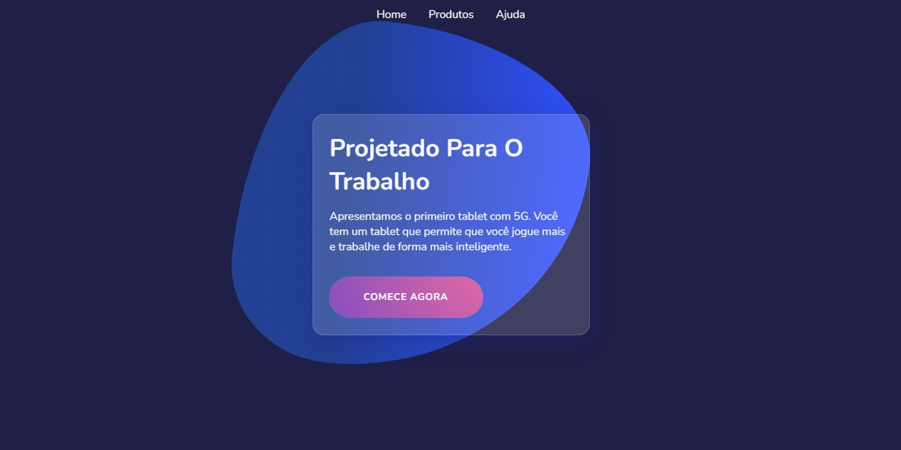
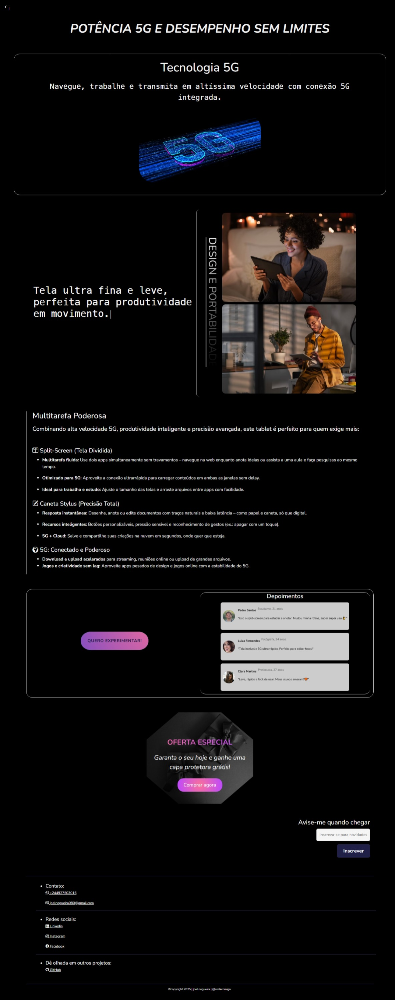

# Tablet 5G Site Demo
 Site de lançamento do novo tablet 5G. Demo

## 🚀 Como Usar

Basta acessar o site: [Tablet-5G](https://tablet5g.netlify.app/) 🌍

## 🛠️ Tecnologias

- Linguagens: 
        HTML, 
        CSS, 
        JavaScript (para o efeito do button, observar a section com a function "IntersectionObserver" para o efeito fade-in, e efeito TypeWritter)
- Ferramentas: Git, VS Code

## 📸 Screenshots
#### Menu inicial:

#### Página de conteúdo:

## Minhas redes sociais
#### WhatsApp +244927503016
#### [Envia-me um e-mail](mailto:joelnogueira080@gmail.com) 📧
#### [Visita-me no linkedin](https://linkedin.com/in/joel-nogueira) 👋
#### [visita-me no instagram](https://instagram.com/joelnogueira.com) 👋
#### [Visita-me no facebook](https://www.facebook.com/profile.php?id=61551343635224&sk=about) 👋

## 🤝 Como Contribuir

Contribuições são bem-vindas! Siga os passos abaixo:

1. Faça um fork do projeto.
2. Crie uma branch (`git checkout -b feature/nova-feature`).
3. Commit suas mudanças (`git commit -m 'Adiciona nova feature'`).
4. Push para a branch (`git push origin feature/nova-feature`).
5. Abra um Pull Request.

## 📄 Licença

Este projeto está sob a licença MIT. Veja o arquivo [LICENSE](LICENSE) para mais detalhes.
